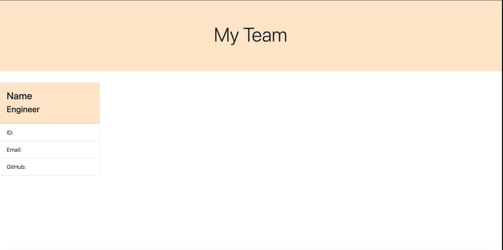

# Team-Profile-Generator

This application is created for the purpose to help upper mangement generate multiple profiles of their team. Types of employees that can be generated are: intern, engineer, and manager. 

The node server will prompt you the following: 

* What type of employee are you adding? 
* What is your email?
* What is your github, linkedin, or school you are attending? (Depending on what type of employee you selected)

After the prompt, this will determine to generate a engineer, intern, or manager card. Once entered all employees, the application will display a page of cards of the whole team.

Technologies used in this application are: HTML, CSS, Javascript, Node

